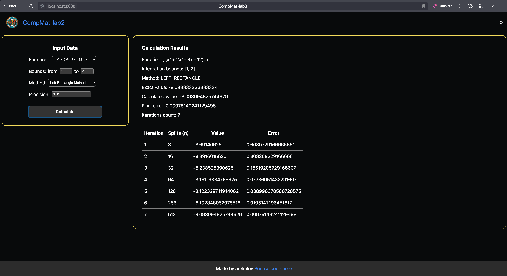

# Лабораторная работа по ВычМату №3
### Численное интегрирование, Вариант 12

## Цель работы
Найти приближенное значение определенного интеграла с требуемой точностью различными численными методами.
№ варианта определяется как номер в списке группы согласно ИСУ.
Лабораторная работа состоит из двух частей: вычислительной и программной.

## Программная реализация задачи
### Исходные данные
1. Пользователь выбирает функцию, интеграл которой требуется вычислить (3-5
   функций), из тех, которые предлагает программа.
2. Пределы интегрирования задаются пользователем.
3. Точность вычисления задается пользователем.
4. Начальное значение числа разбиения интервала интегрирования: n=4.
5. Ввод исходных данных осуществляется с клавиатуры.

### Требования
1. Реализовать в программе методы по выбору пользователя:
   • Метод прямоугольников (3 модификации: левые, правые, средние)
   • Метод трапеций
   • Метод Симпсона
2. Методы должны быть оформлены в виде отдельной(ого) функции/класса.
3. Вычисление значений функции оформить в виде отдельной(ого) функции/класса.
4. Для оценки погрешности и завершения вычислительного процесса использовать правило Рунге.
5. Предусмотреть вывод результатов: значение интеграла, число разбиения интервала интегрирования для достижения требуемой точности.


## Для запуска проекта
1.  ```bash
    $ cd site
    $ kobweb run
    ```
2. Открыть [http://localhost:8080](http://localhost:8080)
3. Для выхода нажать `Q`

